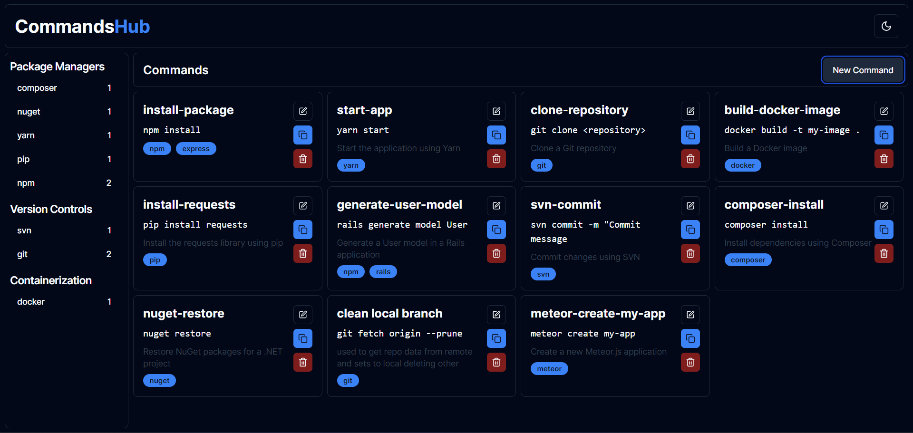

# CommandHub
This project helps you to save important commands and organize it.

This is a [Next.js](https://nextjs.org/) project bootstrapped with [`create-next-app`](https://github.com/vercel/next.js/tree/canary/packages/create-next-app).

Tech: Next js, tailwind, shadcn, typescript, prisma and supabase

## Getting Started

First, install dependencies
```bash
npm install
```
Create database in supabase and create .env like .env.example
And put connection string

After, run 
```bash 
npx prisma db push
```

Next, run the development server:

```bash
npm run dev
# or
yarn dev
# or
pnpm dev
# or
bun dev
```

Open [http://localhost:3000](http://localhost:3000) with your browser to see the result.

you will get page like this after creating commands 



You can start editing the page by modifying `app/page.tsx`. The page auto-updates as you edit the file.

This project uses [`next/font`](https://nextjs.org/docs/basic-features/font-optimization) to automatically optimize and load Inter, a custom Google Font.

## Contributing

you can make a fork and clone it and make changes and do a pull request

you can suggest feature and fix issues

## Learn More

To learn more about Next.js, take a look at the following resources:

- [Next.js Documentation](https://nextjs.org/docs) - learn about Next.js features and API.
- [Learn Next.js](https://nextjs.org/learn) - an interactive Next.js tutorial.

You can check out [the Next.js GitHub repository](https://github.com/vercel/next.js/) - your feedback and contributions are welcome!
